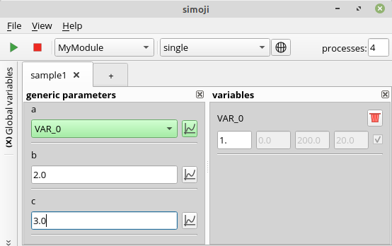
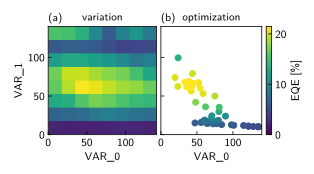

#  simoji 

Simoji is an open source software which enables multidimensional variations of parameter based 
calculation modules. It provides an intuitive and flexible GUI for managing multiple sets of 
parameter configurations in parallel. Besides the input of generic parameters, one-dimensional layer structures can be
constructed and modified by intuitive drag and drop actions. 
Important features of simoji are the automated parallel processing of multiple parameter input sets and the structured 
organization of results in a separate plot window. 

Besides some example modules, simoji includes modules for optical simulations of thin-film samples as for instance 
organic light-emitting diodes (OLEDs). The `RTA` module calculates reflection, transmission, and absorption of a 
coherent layer stack and the `OledOptics` module simulates power dissipation, efficiency, and angle-resolved emission of 
OLEDs. Each module is defined in a separate sub-folder of the `simoji/modules` directory and contains another readme 
file with specific information about the module.

Thank you very much for considering to use and/or contribute to simoji. You can either use the program by running 
existing modules or extend it by writing your own modules. Of course, you are also warmly invited to contribute to the 
core program!
***

## Contents
1. [Introduction](#introduction)
2. [Prerequisites](#prerequisites)
3. [Installation](#installation)
4. [Quick Start](#quick-start)
5. [GUI](#gui)
6. [Examples](#examples)
7. [Results](#results)
8. [Troubleshooting](#troubleshooting)
9. [Program Function](#program-function)
10. [Contribution](#contribution)
11. [Citation](#citation)
12. [Versioning](#versioning)
13. [License](#license)
14. [Acknowledgements](#acknowledgments)

***

## Introduction

This program was mainly developed as part of the doctorate work by 
[Christian Hänisch](https://orcid.org/0000-0003-1331-9507) at the TU Dresden assisted by further 
[contributors](https://github.com/simoji-dev/simoji). The main idea of simoji is to provide a flexible way to extend a 
parameter based calculation to multidimensional variations. Let's take a look at a simple example which illustrates 
this:

Imagine there is a calculation which depends on three floating point parameters `a`, `b`, and `c` which are passed to a 
simoji module called `MyModule` that returns a `result` value. In the GUI of simoji you will get an input field for each
parameter which you can fill with a floating point value which will be passed to the module. This is the most basic way
of using simoji. However, instead of setting a floating point value, you can fill your parameter value with a so-called 
`variable` which you define in a separate widget and which takes a current value but also a start, stop, and step value. 
For instance, the parameter `a` could be filled by a variable `VAR_0` as shown in the following screenshot of the simoji
main window:

<p align="center"></p>

Now simoji provides different execution modes which the user can choose. In `single` mode, the current value of the 
`variable` is set for the parameter. Much more interesting, in `variation` mode, all values in the range between start 
and stop value (separated by the step length) are iteratively passed to the module which now returns not a single result
but a collection of results for each variation step. It is important to note that not only a single parameter can be 
set by a variable but that in principle every parameter can take an individual or also shared variables. In our example, 
it could be that the parameters `a` and `b` take the variable `VAR_0` whereas parameter `c` gets another variable 
`VAR_1`. In this case, the variation would cover a two-dimensional parameter space with one specific input value 
configuration for each point in this space. The results of each variation step are displayed in separate tabs in the 
so-called `plot window`. It also contains a `global` tab which summarizes the numerical results and variable values of 
each variation step. A third execution mode of simoji is the `optimization`. It is based on minimizing or maximizing a
result value of the module by walking through the parameter space defined by all variables which are set to the 
parameters. In the following picture a comparison of result values from `variation` and `optimization` mode are given 
for a calculation of the efficiency of an organic light-emitting diode depending on two thickness values.

<p align="center"></p>

## Prerequisites

Simoji is written in python3 and is cross-platform operable. It is tested with Windows10 and LinuxMint19 but 
should, in principle, also work on other operating systems.

The following python packages are required:
> PySide2==5.15.2.1 <br>
> numpy==1.19.5 <br>
> scipy==1.5.4 <br>
> matplotlib==3.2.2 <br>
> anytree==2.8.0 <br>
> psutil==5.9.0 <br>

## Installation
These instructions will get you a copy of the project up and running on your local machine for usage and/or development. 
It is also possible to build an executable file of the program as described in the second part of this section.

### Download repository and run in virtual environment

It is highly recommended running the program in a virtual environment (venv) which can be equipped with all the 
necessary site packages without effecting the system installation. Such a venv can be created via

```
python3 -m venv [venv-name]
```

Logging into this venv is done via 

* Linux: `source [venv-name]/bin/activate`
* Windows: `source [venv-name]\Scripts\activate`

To install all required python packages one can relay on the setup.py file on the top level of the repository. It 
includes a list of requirements which will be installed by running

```
pip install -e .
```

The `-e` flag makes sure that program is installed in an editable state, and all the edits made to the .py files will be 
automatically included in the installed package.

Finally, we can run simoji by navigating to the `simoji` folder and execute 

```
python main.py
```
### Build executables via PyInstaller

One can build an executable file by using pyinstaller in the top level folder:

`pyinstaller simoji_builder.spec`

This will create an executable file in the `dist` folder which can then be copied and run on other systems with the same 
OS. 

NOTE: An executable works only on the OS is was build. So if you want to use the executable on a Windows system, you 
have to build it on a Windows system.

## Quick Start

todo

## GUI

todo

## Examples

tode

## Results

todo

## Troubleshooting

todo

## Program Function

todo

## Contribution

Please read [CONTRIBUTING.md](CONTRIBUTING.md) for details on our code of 
conduct, and the process for submitting pull requests to us.

## Citation

todo

## Versioning

We use [SemVer](http://semver.org/) for versioning. For the versions available, see the 
[tags on this repository](https://github.com/simoji-dev/simoji/tags). 

## License

This project is licensed under the LGPL license - see the [LICENSE.md](LICENSE.md) file for details

## Acknowledgments
Big thanks to:
* Corni who introduced me to optical simulations and python coding
* Andi for fruit- and coffee-ful discussions, matrixing the transfer matrix, and break through 
ideas like module loading and figure sending
* Sebastian for supporting my rather unphysical side project
* StackOverflow for countless pieces of help and inspiration
* All early-day simoji users who gave me valuable feedback 

